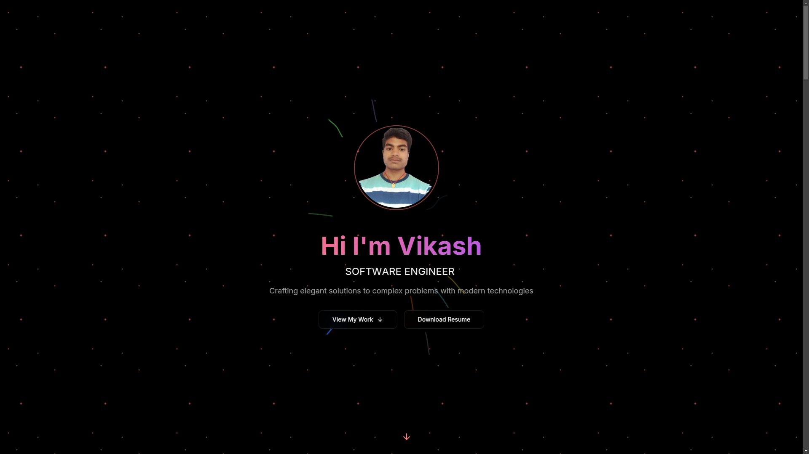
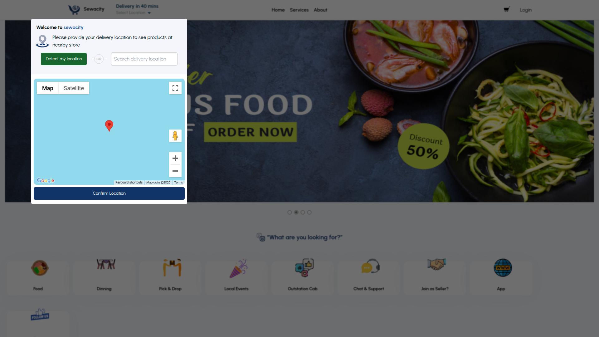
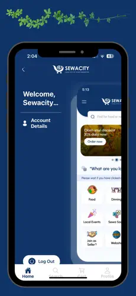
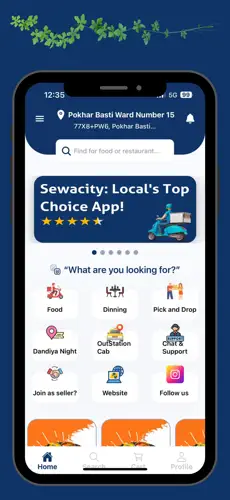
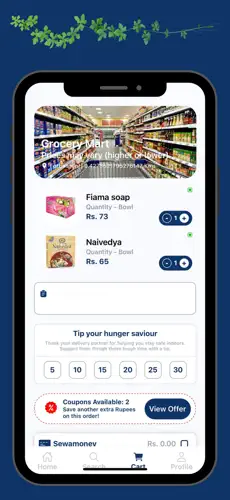
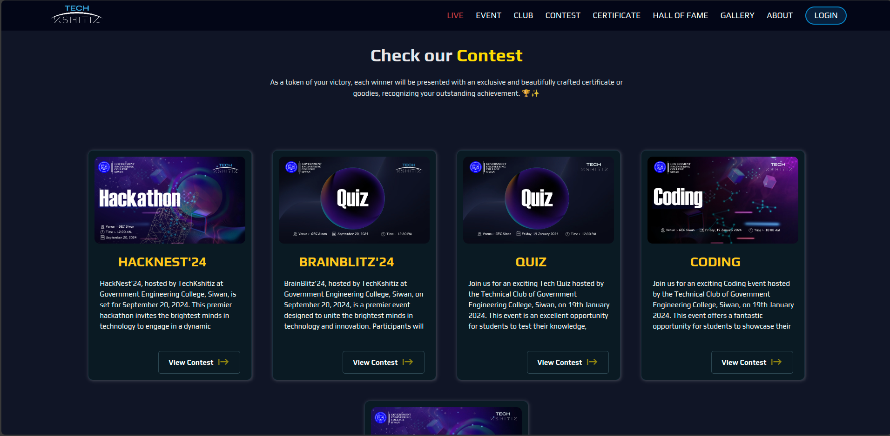
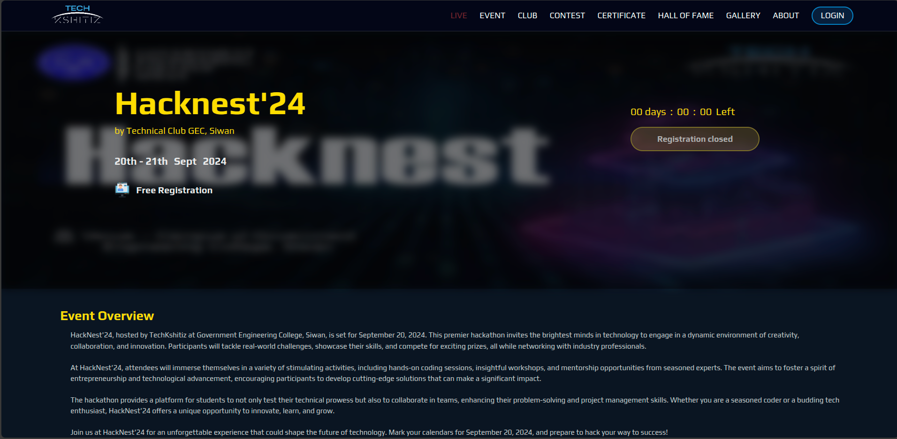
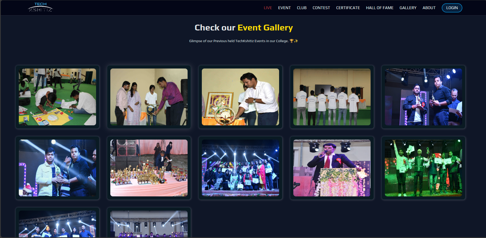

# Vikash Kumar - Software Developer

Welcome to my GitHub profile! I'm Vikash Kumar, a dedicated Software Developer with a strong enthusiasm for coding, innovation, and technology exploration. My current focus is on web and mobile development, backend systems, and database management. I'm always eager to learn about emerging technologies and collaborate on exciting projects.   
<!--  
## About Me
       
I thrive on challenges and am always eager to learn and experiment with new technologies. Throughout my development journey, I've been driven by a passion for innovation and have consistently sought out opportunities to collaborate on exciting projects that push the boundaries of what's possible. --> 

 
<!-- ## Interests  

- **Software Development:** I'm passionate about software development, with a strong focus on frontend web and mobile development and backend systems, utilizing both SQL and NoSQL technologies. My diverse skill set enables me to create seamless and efficient applications.
- **Coding**: I am passionate about coding and enjoy solving complex problems through elegant solutions.
- **Innovation**: I'm constantly exploring new ideas and innovations, looking for ways to apply technology to make a positive impact. -->

## Chart of My GitHub Activity

## 📊 GitHub Stats

## 🔥 Most Used Languages

## 🚀 GitHub Streak

## 🏆 GitHub Trophies

## 📈 Profile Stats

## 🚀 Tech Stack

### 🖥️ Frontend

### ⚙️ Backend

### 🖥️ OS

### 🗄️ Database

 
<!--  -->

### 🚀 DevOps

### 🛠️ Tools

### 🎨 UI Libraries and Frameworks

### 💻 Other Technologies

>)

<!-- ## Current Focus

As a Software Developer, my current focus areas include:

- **Web Development**: Mastering modern web technologies such as REACT, NEXT, or REACT Native to create intuitive and responsive user interfaces.
- **Backend Development**: Strengthening my backend skills with NODE, EXPRESS, PHP, and other frameworks or libraries to build robust and scalable server-side applications.
- **Database Management**: Exploring database technologies like MongoDB and MySQL for efficient data storage and retrieval.
- **Mobile App Development**: Learning more about mobile app development with REACT Native to create cross-platform applications for Android and iOS.
- **DevOps**: Exploring DevOps practices and tools to streamline the development process and improve deployment efficiency.
- **Data Structures and Algorithms**: Enhancing my problem-solving skills through practice and study of data structures and algorithms. -->

---

## Projects

### 1. **Portfolio Website**

**Description**: My personal portfolio to showcase my skills, projects, and achievements.  
 **Technologies**: HTML, CSS, JavaScript, React (optional)  
 
**Demo Link**: [View My Portfolio](https://www.vikashkrdeveloper.me)

---

### 2. **Sewacity Quick-Ecommerce App**

**Description**: Developed an e-commerce application during my internship, focusing on enhancing user experience and optimizing performance.  
 **Technologies**: Node.js, Express, MongoDB, React  
 
**Demo Link**: [View this project](https://sewacity.com/)

---

### 3. **Sewacity E-commerce Mobile User App**

**Description**: A cross-platform React Native app for Sewacity, focusing on a seamless user experience for mobile users.  
 **Technologies**: React Native, JavaScript, Redux  

  
**Demo Link**: [View this project](https://apps.apple.com/in/app/sewacity/id6737736747)

---

### 4. **Coding Contest Platform**

**Description**: A platform designed for hosting online coding contests for my college, enabling students to participate in challenges and competitions.  
 **Technologies**: Node.js, Express, MongoDB, WebSocket  
 
**Demo Link**: [View this project](https://example-demo-link.com)  
 **Repository**: [Code Editor Repository](https://github.com/vikashkrdeveloper/Online-Test-Website-1.1.git)

---

### 5. **College Technical Club Fullstack Site**

**Description**: A full-stack website for the technical club at my college, featuring event management and member profiles.  
 **Technologies**: React, Node.js, MongoDB  
 

**Demo Link**: [View this project](https://techkshitiz.vercel.app)

---

### 6. **Social Media App**

**Description**: A social media platform that allows users to connect, share content, and interact with each other.  
 **Technologies**: React, Node.js, MongoDB, JWT, Socket.io  
 
**Demo Link**: [View this project](https://example-demo-link.com)  
 **Repository**: [Social Media App Repository](https://github.com/vikashkrdeveloper/algocoretech.socialmedia.mern.project.git)

---

### 7. **CRUD Operations**

**Description**: A web app for performing CRUD operations on a database, demonstrating core web development skills.  
 **Technologies**: React, Node.js, MongoDB  
 
**Demo Link**: [View this project](https://example-demo-link.com)  
 **Repository**: [CRUD Operations Repository](https://github.com/vikashkrdeveloper/curdoperation.git)

---

### 8. **Polling Booth**

**Description**: An online polling platform for conducting surveys and collecting user responses.  
 **Technologies**: React, Node.js, MongoDB  
 
**Demo Link**: [View this project](https://example-demo-link.com)  
 **Repository**: [Polling Booth Repository](https://github.com/vikashkrdeveloper/PollingBoothTwo.git)

---

### 9. **E-commerce App**

**Description**: An e-commerce application designed for buying and selling products online, built with a full-stack architecture.  
 **Technologies**: React, Node.js, MongoDB, Stripe  
 
**Demo Link**: [View this project](https://example-demo-link.com)  
 **Repository**: [E-commerce App Repository](https://github.com/vikashkrdeveloper/fullstack-ecommerceapp-algocoretech.git)

---

### 10. **Sales-Analyzer**

**Description**: A sales analyzer application designed to visualize and analyze sales data for better business insights.  
 **Technologies**: React, D3.js, Chart.js  
 
**Demo Link**: [View this project](https://sales-analyzer.vercel.app/)  
 **Repository**: [Sales_Analyzer Repository](https://github.com/vikashkrdeveloper/Sales-Analyzer.git)

---

## Collaboration

I'm eager to explore collaboration opportunities on projects that leverage cutting-edge technologies, especially in the fields of AI/ML, web development, and creative applications. Don't hesitate to contact me if you have an interesting project or concept you'd like to work on together!

<!-- ## Contact Me

- **Email**: vikashjjp728@gmail.com
- **LinkedIn**: [Vikash Kumar](https://www.linkedin.com/in/vikashkrdeveloper/)
- **Portfolio**: [Portfolio Website](https://vikashkrdeveloper.me)
- **GitHub**: [GitHub Profile](https://github.com/vikashkrdeveloper)
- **Instagram**: [Instagram Profile](https://www.instagram.com/vikashkrdeveloper/) -->

## 🚀 Connect with Me:

I'm always open to connecting with like-minded individuals! Whether you want to discuss potential collaborations, exchange ideas, or just get in touch, feel free to reach out. You can find me on LinkedIn, email, or GitHub. I'm happy to assist with any questions or project inquiries you may have.

## License

This project is licensed under the [MIT License](LICENSE.md), allowing you to use, modify, and distribute the code as needed.

<!---
vikashkrdeveloper/vikashkrdeveloper is a ✨ special ✨ repository because its `README.md` (this file) appears on your GitHub profile.
You can click the Preview link to take a look at your changes.
--->
