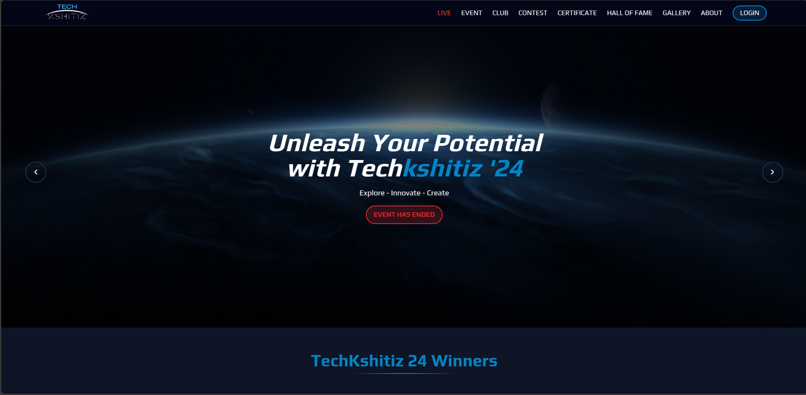

## **Hi, I'm Vikash - Software Developer**
 
I specialize in developing **web applications**, **mobile apps**, and scalable **backend systems**. I have hands-on experience with **databases**, **cloud technologies**, and a growing passion for integrating **AI solutions** into real-world projects. While I understand design fundamentals, my core strength lies in building efficient, tech-driven systems. I’m always exploring new technologies and pushing boundaries to innovate. 

## Chart of My GitHub Activity
  
 
## 📊 GitHub Stats 

## 🔥 Most Used Languages

## 🚀 GitHub Streak
 

## 🏆 GitHub Trophies

## 📈 Profile Stats.

## 🚀 Tech Stack
 
### 🖥️ Frontend

### ⚙️ Backend

### 🖥️ OS

### 🗄️ Database

 
<!--  -->

### 🚀 DevOps

### 🛠️ Tools

### 🎨 UI Libraries and Frameworks

### 💻 Other Technologies

>)

---

## Projects

### 1. **Contest Management System (like TCS NQT Platform)**

**Description**: 
- Developed a robust system capable of handling large-scale contests with thousands of users and auto-assigned computers.
- Implemented automated participant seating logic, user verification, and test workflows to simulate real exam environments.
- Designed for scalability, with potential to serve institutions and competitive exam bodies. Government Engineering College, Siwan – Jan 2024.
- Recognized for innovative problem-solving and effective team collaboration in a high-pressure, time-constrained environment.
 
 **Technologies**: Next JS, Node/Express, MongoDB, Firebase  
 
 
 
**Demo Link**: [Click here to view](https://testing.devconfig.in/)

---

### 2. **Sewacity Quick-Ecommerce App**

**Description**: Developed an e-commerce application during my internship, focusing on enhancing user experience and optimizing performance.  
 **Technologies**: Node.js, Express, MongoDB, React
 
 
 
**Demo Link**: 
- [Click here to view Quick Ecommerce project](https://sewacity.com)
- [Click here to view ticket booking project](https://book.sewacity.com)

---

### 3. **Food Delivery System (Mobile App)**

**Description**: 
- Designed and developed a full-stack food delivery solution with real-time order tracking, cart management, and user authentication.
- Created both mobile **Android** and **IOS** app using *REACT NATIVE* cross, platform for end-to-end order placement, delivery management, and restaurant panel control.
- An implemented end-to-end notification system like *Push Notification*, *In app Notification*, with proper manual and action ringing.
- Focused on clean UX, performance, and mobile responsiveness.
  
 **Technologies**: React Native, JavaScript, Redux, Firebase.

  

**Demo Link**: 
- [Click here to view in android](https://play.google.com/store/apps/details?id=com.sewacity.sewacity)
- [Click here to view in IOS](https://apps.apple.com/in/app/sewacity/id6737736747)

---

### 4. **College Club Portfolio**

**Description**: A full-stack website for the technical club at my college, featuring event management and member profiles.  
 **Technologies**: React, Node.js, MongoDB
 

**Demo Link**: [View this project](https://techkshitiz.vercel.app)

---

## Collaboration

I'm eager to explore collaboration opportunities on projects that leverage cutting-edge technologies, especially in the fields of AI/ML, web development, and creative applications. Don't hesitate to contact me if you have an interesting project or concept you'd like to work on together!  

## 🚀 Connect with Me:

